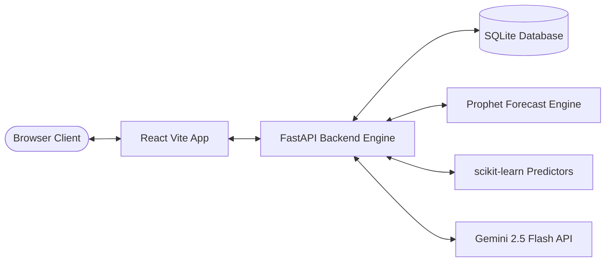

# Platform Architecture & System Design

This document details the high-level architecture of the **Pioneer Nexus Analytics Platform**, a production-grade, double-cached web application connecting local databases with time-series ML models and GenAI.

---

## 1. System Topology

Pioneer Nexus is structured as a decoupled mono-repo combining a high-performance REST API with a reactive user interface:

- **Client Presentation**: Single Page Application built on React, Vite, Tailwind CSS, Lucide icons, and Recharts.
- **Backend Service**: High-performance FastAPI server running on Python uvicorn.
- **Relational Storage**: SQLite for local validation (falls back from production PostgreSQL).
- **ML Inference**: Local scikit-learn models (Random Forest) and Prophet loaded lazily with thread-safe locking.
- **LLM Pipeline**: Google Gemini 2.5 Flash API for descriptive summarization and Text-to-SQL compilation.

---

## 2. Backend Engine Layers

The backend codebase is structured into cohesive layers:

- **API Controllers (`main.py`)**: Defines endpoints, routes request validation using Pydantic, applies SlowAPI rate limits, and directs requests to services.
- **Core Config & Database (`core/`)**: Handles database connection pooling, schema migration, centralized configurations, and structured JSON logging.
- **ML Prediction Registry (`MLModels`)**: Thread-safe class handles lazy loading of Prophet, return probability, demand regressor, and label encoders.
- **Business Optimization Logic (`optimization/`)**: Optimization scripts for inventory rebalancing, expiry transfer detection, and warehouse allocations.
- **Prescriptive Analytics (`services/`)**: The Expiry-to-Demand Match Engine combines near-expiry batches with high-demand geographic regions to construct push plans.

---

## 3. Request-Response Telemetry & Caching

To guarantee sub-100ms response times for repeating dashboard queries, a dual-layer caching strategy is applied:

1. **Dashboard KPI Caching**: ttcache caches SQL aggregation metrics for 60 seconds.
2. **GenAI Insight Caching**: ttcache caches LLM descriptive answers for 1 hour.
3. **Database Pooling**: Connections are reused and recycled to eliminate TCP overhead.
