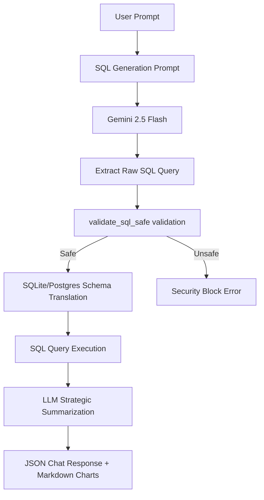

# Text-to-SQL Compiler & Execution Architecture

This document details the production design of the Text-to-SQL execution engine in the **Pioneer Nexus Analytics Platform**. The engine dynamically compiles conversational queries into syntactically valid database queries, executes them against a local database, and synthesizes answers using Large Language Models.

---

## 1. Execution Workflow

The pipeline is designed as a deterministic sequence to ensure security and predictability:



1. **Natural Language Parsing**: The API receives the text query and context (descriptive/predictive KPIs).
2. **Contextual Compiling**: LLM prompt injects standard schema definitions and instructions.
3. **Extraction & Standardization**: Extracted SQL is stripped of markdown annotations and formatting.
4. **Safety Verification**: AST-like blocklists inspect the SQL string for SQL injection and destructive keywords.
5. **Database Execution**: Safe queries are ran with `fetch_data`, enforcing limits and statement timeouts.
6. **Executive Synthesis**: Results are combined with KPI context and formatted into conversational text with Recharts configurations.

---

## 2. Prompt Engineering Design

To minimize hallucination and SQL structure deviation, the compiler uses a **constrained schema-bounded context** prompt:

```text
User Message: "{message}"
Role: Senior SQL Data Analyst for Pioneer Pharma.
Goal: Decide if a database query is needed for table 'liveapp.pharmasales'.

AVAILABLE DASHBOARD CONTEXT:
- Descriptive: {descriptive_kpis}
- Predictive: {predictive_insights}

CRITICAL INSTRUCTIONS:
1. If the User Message can be answered using the 'AVAILABLE DASHBOARD CONTEXT', respond with EXACTLY the word "NO_SQL".
2. ONLY generate a SQL query if the request requires deep-drill data NOT in the context.
3. If generating SQL:
   - Use ILIKE for product_name, region, and warehouse filters.
   - Date Logic for 'At Risk': expiry_date <= CURRENT_DATE + INTERVAL '120 days'
   - Return ONLY the raw SQL query. No explanations, no markdown blocks. Limit to 20 rows.
```

---

## 3. SQL Safety Layer & Validation

To prevent malicious queries, the platform applies a multi-layered guard before database execution:

```python
def validate_sql_safe(sql: str) -> bool:
    sql_clean = sql.strip().rstrip(';')
    sql_upper = sql_clean.upper()
    
    # 1. Enforce SELECT-only read access
    if not (sql_upper.startswith('SELECT') or sql_upper.startswith('WITH')):
        return False

    # 2. Block destructive commands as whole words (prevents false positives on columns like 'updated_at')
    destructive_keywords = ['DROP', 'DELETE', 'TRUNCATE', 'GRANT', 'REVOKE', 'ALTER']
    for kw in destructive_keywords:
        if re.search(r'\b' + kw + r'\b', sql_upper):
            return False
            
    # 3. Block multi-statement queries (prevents piggyback SQL injections)
    if ';' in sql_clean:
        return False
        
    return True
```

---

## 4. Query Execution & Timeout Controls

To protect connection pooling and database availability:
- **Statement Timeout**: Standard connection statements execute with `statement_timeout = 45000` (45 seconds) to prevent lockouts.
- **Strict Pagination**: If a query is generated without a `LIMIT`, the database layer automatically appends `LIMIT 1000 OFFSET 0` to prevent massive memory allocations.
- **SQLite Schema Redirection**: If running on SQLite, the system automatically translates schema prefixes (e.g. `liveapp.pharmasales` is rewritten to `pharmasales`) so that it executes successfully on local database files.

---

## 5. Performance Optimizations & Caching

To reduce Gemini token costs and lower average query latency:
1. **Gemini Cache**: TTLCache caches Gemini prompt-response pairs for 1 hour.
2. **Dashboard Caching**: Calculated KPIs and aggregated database summaries are cached with a 60-second TTL.
3. **Connection Pooling**: Utilizes SQLAlchemy `QueuePool` with 10 pool connections and a max overflow of 20 to handle peak traffic.
